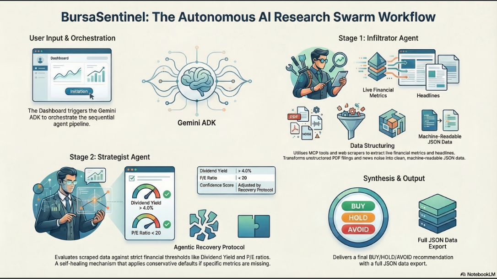
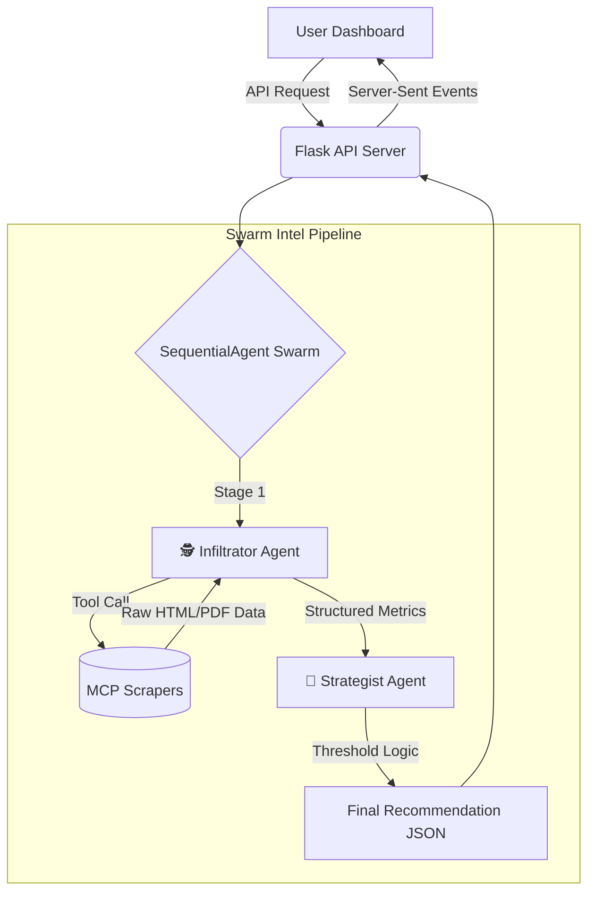

# 🛡️ BursaSentinel: The Strategic Research Swarm

> **Gemini Nexus: Build with AI Hackathon — Track A (Intelligence Bureau)**
> 
> *Synthesizing messy Bursa Malaysia PDF filings and live news into clear, traceable market sentiment.*

---

## 📌 Section 1: The Briefing (Overview)

**What is BursaSentinel?**
BursaSentinel is an autonomous, **SequentialAgent AI Swarm** designed to perform strategic research on Bursa Malaysia listed stocks. 

**The Problem it Solves:**
Financial analysts spend hours manually digging through messy quarterly reports, PDF filings, and fragmented news headlines to calculate metrics like Dividend Yield and P/E ratios. BursaSentinel automates this entire pipeline. By deploying a swarm of specialized Gemini agents, it ingests raw unstructured web data, cross-references it against strict financial thresholds, and delivers a final synthesised BUY/HOLD/AVOID recommendation in seconds.

---

## 🚀 Section 2: Activation (Quick Start)

*Judges: You can have the entire swarm running locally in under 2 minutes.*

**Prerequisites:** 
- Python 3.9+
- A Google Gemini API Key (Get one at [Google AI Studio](https://aistudio.google.com/app/apikey))

### Step-by-Step Setup

1. **Install Dependencies**
   ```bash
   pip install -r requirements.txt
   ```

2. **Configure API Key**
   Create a `.env` file in the root directory (or edit the existing one) and add your key:
   ```env
   GOOGLE_API_KEY=your_actual_api_key_here
   ```
   *(Note: Never commit your `.env` file!)*

3. **Launch the API Server**
   ```bash
   python app/api_server.py
   ```

4. **Open the Dashboard**
   Simply click and open `app/index.html` in your favorite web browser.

---

## 🎯 Section 3: Operating the Swarm (How to Use)

Once the dashboard is open and the server is running (indicated by the **🟢 Gemini Agent Live** pill in the top right):

1. **Target Selection:** Select a company from the dropdown menu (e.g., "MAYBANK — Malayan Banking").
2. **Execute:** Click the **Run Swarm** button.
3. **Trace the Logic:** Watch the Live Pipeline animation. Once complete, read the **`<thought_trace>`** blocks in the UI. This is our Demo Protocol — absolute transparency into *how* the Gemini agents arrived at their conclusions.
4. **Export:** Click **Export JSON** to instantly download the structured, machine-readable final report.

---

## ⚙️ Section 4: Technical Specs & Architecture

BursaSentinel achieves high **Technical Depth** by utilizing modern agentic frameworks:

* **Gemini ADK (Agent Development Kit):** Orchestrates the `SequentialAgent` pipeline, passing state smoothly from one discrete agent to the next.
* **MCP (Model Context Protocol) Tools:** The Infiltrator agent is equipped with custom MCP web scrapers (`BursaScraperTool`, `NewsScraperTool`) extracting live data via BeautifulSoup4.

### The Swarm Architecture (A2A Flow)





### Agent Capabilities

* **🕵️ The Infiltrator Agent:** The data collector. Tasked with traversing the web, scraping live financial metrics and headlines, and structuring the unstructured noise into clean JSON data.
* **🧠 The Strategist Agent:** The logical reasoner. Takes the Infiltrator's data and evaluates it against strict, configurable thresholds (e.g., *Dividend Yield > 4.0%*, *P/E < 20*). 

---

## 🛡️ Section 5: Safety & Agentic Recovery

To achieve maximum **Agentic Agency**, the swarm doesn't just crash when a website blocks a scraper or data is missing. It heals itself.

**The Agentic Recovery Protocol:**
If the Infiltrator fails to find a specific metric (e.g., `pe_ratio: null`), the Strategist Agent detects this anomaly in Stage 2. Instead of failing, the Strategist triggers an autonomous recovery protocol:
1. It applies a conservative "worst-case" default (e.g., assuming high P/E or low Yield).
2. It automatically downgrades the `confidence` score of the final report to "LOW".
3. It logs exactly what it did in the `recovery_log` for the human analyst to review.

---

## ⚠️ Troubleshooting & Quotas

**"Quota Exhausted" (429 Rate Limit) Error:**
If you run the swarm multiple times rapidly on the Free Tier, you may hit Google's rate limits.
* **The Fix:** Please wait 60 seconds before clicking "Run Swarm" again. Alternatively, attaching a billing account to your Google Cloud project unlocks 60 RPM performance and resolves this instantly. 

---
*BursaSentinel — Built for the Gemini Nexus Hackathon (2026)*
